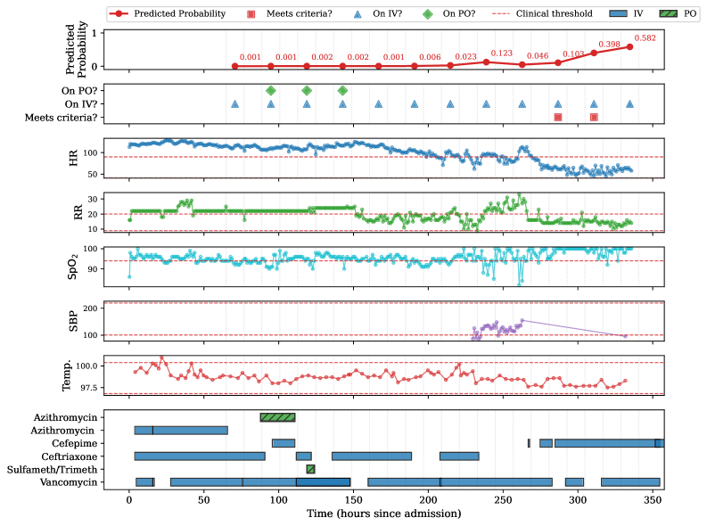

# Arxiv 2026 paper


Please see [Arxiv](https://arxiv.org/abs/2603.08242) for the paper including the PDF


Timely transition from intravenous (IV) to oral antibiotic therapy shortens hospital stays, reduces catheter-related infections, and lowers healthcare costs, yet one in five patients in England remain on IV antibiotics despite meeting switching criteria. Clinical decision support systems can improve switching rates, but approaches that learn from historical decisions reproduce the delays and inconsistencies of routine practice. We propose using neural processes to model vital sign trajectories probabilistically, predicting switch-readiness by comparing forecasts against clinical guidelines rather than learning from past actions, and ranking patients to prioritise clinical review. The design yields interpretable outputs, adapts to updated guidelines without retraining, and preserves clinical judgement. Validated on MIMIC-IV (US intensive care, 6,333 encounters) and UCLH (a large urban academic UK hospital group, 10,584 encounters), the system selects 2.2-3.2$$×$$ more relevant patients than random. Our results demonstrate that forecasting patient physiology offers a principled foundation for decision support in antibiotic stewardship.

<figure><figcaption></figcaption></figure>

Figure 5: Example encounter from the MIMIC test set illustrating the intended functioning of the system. The panels show (from top to bottom): predicted switch-readiness probabilities from the NP-tuned model; labels indicating oral (PO) and IV antibiotic prescriptions and whether clinical criteria are satisfied in each forecast window; measured vital signs with clinical thresholds for switch-readiness overlaid; and antibiotic prescription timelines, with colour and pattern indicating administration route. Grey vertical lines demarcate daily 12-hour forecast windows. Forecasts begin 48 hours after admission to ensure sufficient historical data for prediction. Variable Abbreviations: HR (Heart Rate), RR (Respiratory Rate), SpO2 (Oxygen Saturation), SBP (Systolic Blood Pressure), Temp. (Temperature). Antibiotic Abbreviations: Sulfameth/Trimeth (Sulfamethoxazole-Trimethoprim).

 
