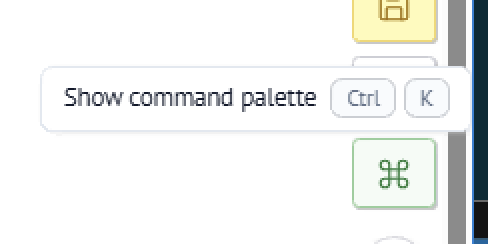

# marimo

Inside the hospital network, we've deployed instances of marimo **per researcher** from GAE13. You can access with an address like:

```
http://uclvlddpragae13:908X
```

`x` will be a number unique to you. You'll also need your marimo password (ask one of the RSE team).


## New: DuckLake connection

We've now implemented a function to help you connect directly to the "data lake". The old snapshot method will still work (for now), but for the very latest data, including some `silver` tables, try the following.


To connect to the database for the first time, run the following in a new notebook:

```python
from notebooks.utilities import connect_to_camino
con = connect_to_camino()
```

Once you've connected, you can [interact via SQL](https://docs.marimo.io/guides/working_with_data/sql/#example) (choose SQL cells) or in Python using the [DuckDB Python library](https://duckdb.org/docs/stable/clients/python/overview), or with the [visual database explorer on the sidebar](https://docs.marimo.io/guides/editor_features/panels/) of the interface. (Or a mix of all three.)

### SQL Cells

In marimo you can create a cell of type SQL which allows you to run (read-only) SQL queries against the data.

When you do this, marimo will automatically create and run a Python cell:

```python
import marimo as mo
```

(If you haven't already imported the `marimo` Python package into your session)

When using SQL cells, be sure to check that the connection option is your named connection to the Camino database:

<figure><figcaption></figcaption></figure>

If you named the connection `con` (i.e. ran `con = connect_to_camino()`  at the top of your notebook) then select:

> &#x20;DuckDB (con)


## See also

* [marimo user documentation](https://docs.marimo.io/guides/)
* [DuckDB Python library documentation](https://duckdb.org/docs/stable/clients/python/overview)


### File upload

You can upload local files from your computer to marimo. This is useful, for example if you have a CSV file that you want to use in a `JOIN` or some online data analysis.

To upload a local file, open a new marimo notebook and go to the "View files" icon in the top left-hand side of the webpage to open the marimo [file browser sidebar](https://docs.marimo.io/guides/editor_features/panels/):

<figure><figcaption></figcaption></figure>

From the sidebar file browser, choose "Upload file", and select the file from your local machine:

<figure><figcaption></figcaption></figure>

The file is uploaded to the temporary top-level "Landing" area. You should move it into `data/` or `notebooks/`  (you can click and drag the file).&#x20;

<figure><figcaption></figcaption></figure>

The `camino/` directory is read-only. It's where the Camino data is stored on disk. You can't move your uploads in there.


Be sure to move your uploaded file from the "Landing" area to either `data/` or `notebooks/`.\
**Files left in the landing area are removed when marimo is updated!!**


### Troubleshooting

A common problem is that an update happens to the Camino data lake, for example, a new table or column has been promised, but it doesn't appear in the individual researchers' marimo session.

If this happens try:

* Running a query to read the last value of `camino.bronze.Timestamps` which should show the last Clarity extraction (when the data was last updated).
* Re-establishing a connection. That is: re-evaluate the cell which calls `connect_to_camino` .
* Restarting the kernel. Save your work, then in the bottom right of the Window, select the "⌘" symbol and choose "Restart kernel".

<figure><figcaption></figcaption></figure>

* Save your work, then ask one of the RSE team to update and restart your marimo instance.
