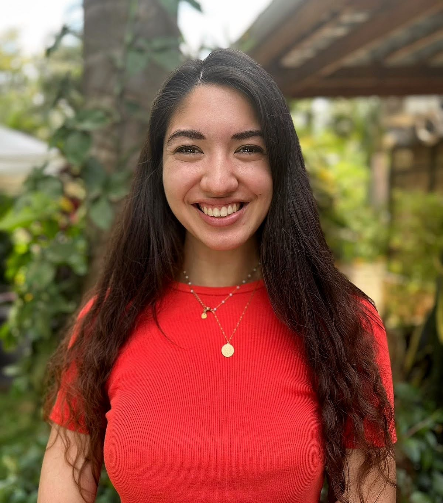

# Sonia Vallentin


{% column width="33.33333333333333%" %}

<figure><figcaption></figcaption></figure>



{% column width="66.66666666666667%" %}
Sonia is Programme Manager for the RADIX project.&#x20;

Before joining the RADIX team she worked in strategy and operations at a health tech scale-up, and managed multi-country research programmes in clinical neurosciences across Sub-Saharan Africa and Asia.&#x20;



