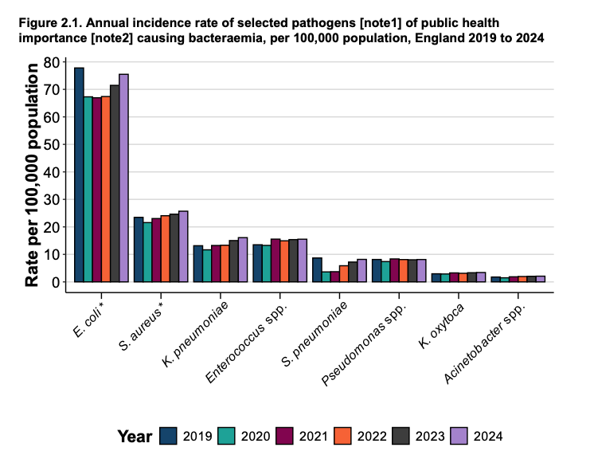

# JRO protocol


See [UCL/UCLH Interventional studies protocol template](https://www.ucl.ac.uk/joint-research-office/sites/joint_research_office/files/jro_interventional_protocol_template.docx) (section number matches the template)

Use this document to manage version control and print or convert to a word document directly from here when ready to submit


### 1. Introduction


Leave for now: will be written after Background and Rationale complete



**Via JRO:** Overview of the study; it should be sufficient to guide the reader to the main purpose of the study, how it will be conducted, on which population(s) and its expected benefits. It should say how the results of the study would benefit in terms of clinical practice, policy or the NHS as whole. The introduction may include a study flowchart (recommended: allows users of the document to follow the participant and study pathway with ease, e.g. via a Gantt chart or timeline of activity), and should detail whether this project is being conducted in relation to an academic qualification (a student project), or is related to any previous research sponsored by UCL.


### 2. Background and Rationale

The [INSPIRE cluster randomised trial](#user-content-fn-1)[^1] demonstrated that computerised provider order entry (CPOE) prompts reduced use of extended spectrum antibiotics.(Gohil _et al._, 2024, [https://doi.org/10.1001/jama.2024.6248](https://doi.org/10.1001/jama.2024.6248))

Urinary Tract Infections (UTIs) contribute to approximately 190,000 hospital admissions in England resulting in 1.2 million bed days in 2023/4. They are the most frequently occurring healthcare associated infection and account for approximately 23% of all antibiotic prescriptions in primary care, only second to respiratory tract infections in the UK (Dolk _et al. 2018,_[10.1093/jac/dkx504](https://doi.org/10.1093/jac/dkx504)).

Most UTI prescriptions are given empirically before culture results are available. In Scotland,  it is estimated in Scotland 40% of bacteria that cause UTIs are resistant to antimicrobial used (McCowan _et al_,[https://doi.org/10.1186/s12879-022-07768-7](https://doi.org/10.1186/s12879-022-07768-7)). In 2024, Enterobacterales comprised 80.6% of urinary isolates, _Escherichia coli (E. coli)_  accounting for around 70% of all episodes (ESPAUR 2025).  UTIs that are not adequately treated can lead to bacteraemia, with approximately 50% of _E Coli_ bacteraemia originating from a urinary tract source. These enterobacterales _(E. coli, K. pneumoniae, and K. oxytoca_)  which are common causes of UTIs and bacteraemias dominate the burden of antibotic resistance accounting for 85% of antibiotic resistance bacteraemia of the total in 2024 (ESPAUR 2025)

<figure><figcaption></figcaption></figure>

From UKHSA , ESAPUR report





### 3. Objectives and outcome measures

#### Primary objective

#### Secondary objective

#### Outcome measures/endpoints

### 4. Trial design

### 5. Sampling methods

#### Inclusion criteria

#### Exclusion criteria

#### Recruitment

#### Consent

### 6. Intervention

### 7. Trial procedures

### 8. Finance and supply of equipment

### 9. Data management

### 10. Statistical considerations

### 11. Assessment and management of risk

### 12. Recording and reporting adverse events

### 13. Oversight committees

### 14. Regulatory review and patient and public involvement

#### Regulatory review

#### Peer review

#### Patient and public involvement

### 15. Monitoring and auditing

### 16. Training

### 17. Insurance and indemnity

### 18. Record keeping and archiving

### 19. Intellectual property

### 20. Publication and dissemination

### 21. References

### 22. Appendices

[^1]: Gohil, S.K. _et al._ (2024) ‘Stewardship prompts to improve antibiotic selection for pneumonia: The INSPIRE randomized clinical trial’, _JAMA_ \[Preprint]. Available at: [https://doi.org/10.1001/jama.2024.6248](https://doi.org/10.1001/jama.2024.6248).
