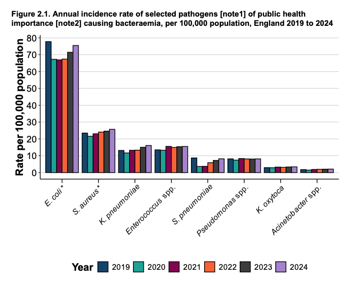

# JRO protocol


See [UCL/UCLH Interventional studies protocol template](https://www.ucl.ac.uk/joint-research-office/sites/joint_research_office/files/jro_interventional_protocol_template.docx) (section number matches the template)

Use this document to manage version control and print or convert to a word document directly from here when ready to submit


### 1. Introduction


Leave for now: will be written after Background and Rationale complete



**Via JRO:** Overview of the study; it should be sufficient to guide the reader to the main purpose of the study, how it will be conducted, on which population(s) and its expected benefits. It should say how the results of the study would benefit in terms of clinical practice, policy or the NHS as whole. The introduction may include a study flowchart (recommended: allows users of the document to follow the participant and study pathway with ease, e.g. via a Gantt chart or timeline of activity), and should detail whether this project is being conducted in relation to an academic qualification (a student project), or is related to any previous research sponsored by UCL.


### 2. Background and Rationale





#### Disease-Specific Background

_Prevalence_

Urinary Tract Infections (UTIs) contribute to approximately 190,000 hospital admissions in England, resulting in 1.2 million bed days in 2023/4. They are the most frequently occurring healthcare associated infection and account for approximately 23% of all antibiotic prescriptions in primary care, second only to respiratory tract infections in the UK (Dolk _et al. 2018,_ 10.1093/jac/dkx504).

_Importance_

* Impact on patients
* Impact on hospitals
* Impact on healthcare systems

Most UTI prescriptions are given empirically before culture results are available.  An estimated 40% of bacteria that cause UTIs can be resistant to the antimicrobials used, with 18-21% of patients experiencing treatment failure. (McCowan _et al 2022_, https://doi.org/10.1186/s12879-022-07768-7, _Moon et al 2022_, https://doi.org/10.1371/journal.pone.0277713). UTI recurrence is common, with repeated infections, further compounding antimicrobial use and resistance.&#x20;

Inadequately treated UTIs can lead to bacteraemia, with approximately 50% of _E Coli_ bacteraemia originating from a urinary tract source (ESPAUR 2025). In 2024, Enterobacterales comprised 80.6% of urinary isolates, _Escherichia coli (E. coli)_ accounting for around 70% of all episodes (ESPAUR 2025).  These enterobacterales _(E. coli, K. pneumoniae, and K. oxytoca_) which commonly cause both UTIs and bacteraemia, accounted for 85% of resistant bacteraemia in 2024 (ESPAUR 2025).&#x20;

Given this risk of resistance and the clinical impacts it may lead to, prescriptions should be guided by either pathogen susceptibility testing or local clinical guidance, whilst minimising extended spectrum antibiotic use to reduce further resistance.&#x20;



### Research Question

In patients attending secondary care, diagnosed with an _<mark style="color:$warning;">acute infection</mark>_, can an electronic nudge embedded into clinical workflows improve guideline-concordant antibiotic prescribing safely and effectively?

_In adult patients presenting to secondary care with a diagnosis of urinary tract infection or pyelonephritis, does the availability of in situ recent and clinically relevant microbiological culture and sensitivity data at the point of antibiotic prescribing reduce the rate of antimicrobial pathogen mismatch, compared with standard empirical prescribing without prior microbiology?_

### Research Question 2

<figure><figcaption></figcaption></figure>

From UKHSA , ESAPUR report





### 3. Objectives and outcome measures

#### Primary objective

Evaluate the effectiveness of a clinically-integrated digital prescribing nudge for improving administration of guideline-concordant antibiotic treatment.

Evaluate the effectiveness of a clinically integrated digital prescribing nudge for improving administration of antibiotics which reduce pathogen drug mismatch.

#### Secondary objectives

1. Evaluate the safety of the digital prescribing nudge&#x20;
2. Evaluate the acceptability and utility of the nudge to clinicians

#### Outcome measures/endpoints

_Effectiveness:_

1. Proportion of guideline-concordant antibiotic prescriptions in the nudge vs. standard care study arms at 24 hours after initial treatment initiation.
2. Proportion of antibiotic switches from initial prescription at 24, 48 and 72 hours.
3. Proportion of empirical escalation of antibiotic treatment (change in antibiotic treatment independent of new microbiological evidence).
4. Antibiotic defined daily dose per adult per admission.

_Safety:_

1. All cause in-hospital and 90-day mortality.
2. Length of hospital stay.
3. Escalation to level 2 or 3 care.
4. Readmission to hospital within 30 days of discharge.
5. Time to intravenous to oral antibiotic switch.
6. Rates of antibiotic co-prescription.
7. Presence of infection or colonisation by antimicrobial resistant pathogens
8. Incidence of specific infections e.g. C. difficile

### 4. Trial design

_A single centre, randomised, parallel assignment digitally integrated service evaluation._

_Adult patients attending hospital who receive an antibiotic order for an infection, who are prescribed an antibiotic will be included.  There are no exclusion criteria._

_Recruitment will be automatic.  Patients who fulfil the above eligibility criteria will be enrolled in the study and randomised between intervention and standard care arms.  All study data will be extracted from the electronic patient record.  There will be no additional testing or follow up requirements._ &#x20;

_Description of the proposed study workflow:_

1. _Patient diagnosed with infection.  The patient enters the study at the point of antibiotic order placement by the treating clinician.  As such, they may be located in the emergency or outpatient departments or may be an inpatient.  In all cases, they will be receiving their first antibiotic order for the current encounter._&#x20;
2. _Clinician opts for antibiotic treatment and selects desired antibiotic from orders tab search box (e.g. Co-Amoxiclav)._
3. _Clinician enters antibiotic indication data within order window (mandated step) for body system and specific indication (e.g. Lung/CVS, Community Acquired Pneumonia, Mild).  The dose, timing, frequency and duration are entered.  The order is accepted and appears in the orders sidebar for signature._

_There are then two options for delivering the guideline-adherence nudge:_

_Option 1 - Order Validation Prompt_

* _Closing the antibiotic order (or signing the order, tbc) triggers silent evaluation of logic rules determining order appropriateness (compliance against existing guidelines) and second stage eligibility criteria:_
  * _Is this the first antibiotic order associated with the current patient encounter (Y/N)_
  * _Is there discordance between the selected antibiotic, highlighted indication data and clinical guideline (Y/N)_
    * _Discordance is determined by applying the following logical criteria:_
      * _1) Does the patient have a documented allergy to penicillin or a penicillin containing antibiotic preparation?_
      * _2) Does the selected antibiotic for the stated indication align with the guideline recommendation?_&#x20;
  * _Has the patient already been randomised within the study during the current patient encounter (Y/N)_
* _If the patient is receiving the first antibiotic order for the encounter, and the order is discordant with the recommended treatment in the clinical guideline, and the patient has not been previously randomised within the study within the current encounter, then a fourth screening step will occur:_
  * _Does the patient have a documented allergy to the guideline-concordant antibiotic recommendation? (Y/N)_
* _If the patient is allergic to the guideline concordant antibiotic then the alert is suppressed and the patient is not randomised._

_Option 2 - Our Practice Advisory_

_Exactly the same workflow but fires after signing process.  Applies same logical criteria. Under discussion whether 1 > 2 in terms of delivering randomisation and supporting above logic._

_If the eligibility criteria are satisfied then the patient will be randomised to alert or standard care arms (no alert)._ &#x20;

_If randomised to the alert arm, the intervention will display to the clinician during the antibiotic order process:_\
\
&#xNAN;_<mark style="background-color:$warning;">"You are selecting \[abx X1] for \[indication Y].</mark>_\
_<mark style="background-color:$warning;">UCLH guidelines suggest use of \[abx X2] for \[indication Y].</mark>_\
_<mark style="background-color:$warning;">Click here to change the current antibiotic order to \[abx X2], or select a clinical justiification for deviating from the clinical guideline:</mark>_\
_<mark style="background-color:$warning;">1) Requirement for extended spectrum agent use given diagnostic uncertainty</mark>_\
_<mark style="background-color:$warning;">2) Requirement for extended spectrum agent use given additional clinical risk</mark>_ \
_<mark style="background-color:$warning;">3) Approved extended spectrum agent use from microbiology</mark>_\
_<mark style="background-color:$warning;">4) Other (Comment)"</mark>_

### 5. Sampling methods

#### Inclusion criteria

#### Exclusion criteria

#### Recruitment

#### Consent

### 6. Intervention

### 7. Trial procedures

### 8. Finance and supply of equipment

### 9. Data management

### 10. Statistical considerations

### 11. Assessment and management of risk

### 12. Recording and reporting adverse events

### 13. Oversight committees

### 14. Regulatory review and patient and public involvement

#### Regulatory review

#### Peer review

#### Patient and public involvement

### 15. Monitoring and auditing

### 16. Training

### 17. Insurance and indemnity

### 18. Record keeping and archiving

### 19. Intellectual property

### 20. Publication and dissemination

### 21. References

### 22. Appendices

